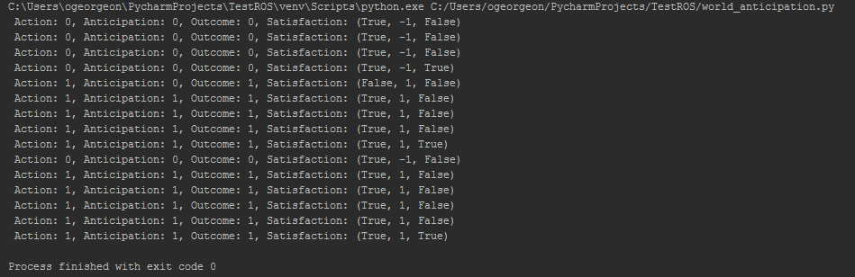

# L'agent qui préférait les interactions positives 
(sauf s'il s'ennuie)

L’agent 2 doit choisir préférentiellement les interactions qui ont une valence positive, sauf s’il s’ennuie, auquel cas il préfère faire une action différente même si elle conduit à une interaction de valence négative. 

Dans la trace, on doit donc voir que l’agent répète plusieurs fois une action qui produit une interaction de valence positive jusqu’à ce qu’il s’ennuie. Ensuite, il fait une seule fois une action différente qui produit une interaction de valence négative. Ensuite, il fait à nouveau plusieurs fois l’action qui produit une interaction de valence positive (Figure 1). 

_Figure 1. Noter que pendant les 4 premiers cycles d'interaction, l'agent n'essaie pas action 1 car il ignore encore qu'elle produit outcome 1 qui correspond à une interaction de valence positive._

Tester votre agent dans Environment1 et dans Environment2. 
Testez aussi votre agent avec une table de valences différentes, par exemple  `valences = [[1, -1], [1, -1]]`. 
Notez que pour certaines valences et dans certains environnement, il peut etre impossible pour l'agent d'obtenir des valences positives. 
