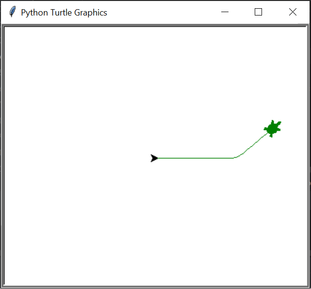

# L'agent qui dompta une tortue

Excuter [l'Agent2 que vous avez fait précédemment](Agent-2) dans l'environnement TurtlePy.
Pour cela, modifiez `world.py` pour que votre agent intéragisse avec l'environnement [Turtlepy_enacter.py](https://github.com/OlivierGeorgeon/TestROS/blob/master/turtlepy_enacter.py).

L'environnement TurtlePy_enacter renvoie outcome 0 quand la tortue avance sans se cogner, et outcome 1 quand elle se cogne sur le bord de la fenêtre. Il peut être nécessaire d'agrandir la fenêtre avec votre souris pour voir le bord. 

_Figure 1: Les déplacements générées par TurtlePy-enacter dans l'environnement TurtlePy_

Créer un Agent3 en modifiant votre Agent2 pour qu'il puisse choisir parmi 3 actions: 0, 1 ou 2. 
Choisissez des valences pour les interactions qui font que l'agent ne se retrouve pas coincé sur un bord de l'environnement TurtlePy. 

Si votre agent se retrouve systématiquement coincé contre un mur ou dans un coin, modifiez les valences ou modifiez son code en jouant sur la façon dont il gère l'ennui, ou la façon dont il pioche des actions arbitrairement, afin qu'il ne se retrouve pas coincé trop rapidement.  Ne vous lancez pas dans des modifications de code trop compliquées, ce sera l'objet de l'Agent 4! 