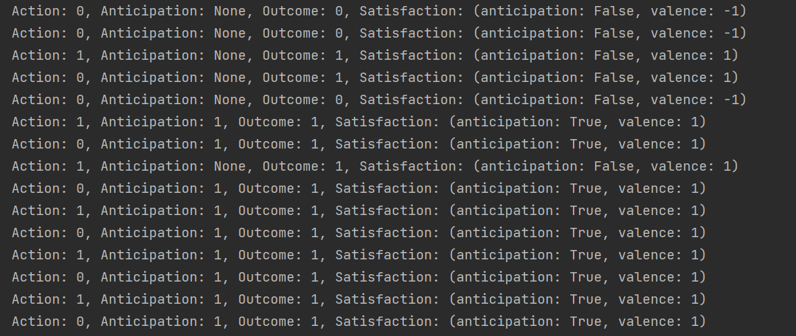

# L'agent qui s'adaptait au contexte

Créer l’Agent4 qui apprend à anticiper les résultats de ses actions dans n’importe lequel des trois environnements 1, 2 ou 3. Faire en sorte que L'Agent4 utilise cette nouvelle capacité d'anticipation pour choisir les actions qui produisent des interactions qui ont une valence positive.

L’agent 4 va donc devoir choisir sa prochaine action en fonction du contexte dans lequel il se situe.
Nous allons caractériser le contexte par l’interaction (couple [action, outcome]) qui a été effectuée au cycle d’avant. 
A chaque fin de cycle _t_, l'agent doit mémoriser la séquence [interaction(_t-1_), interaction(_t_)] qui a été effectuée.

Pour faciliter l'implémentation, utiliser la class `Interaction` disponible dans [agent4_base.py](../agent4_base.py).

Le mécanisme prédictif de l’agent va se baser sur cette mémoire des paires d'interaction pour anticiper l’interaction qu’il pourra faire au temps _t+1_ connaissant l’interaction qu’il a faite au temps _t_.

_Figure 1: Exemple de trace de l'Agent4 dans l'Environnement3._

Tester l'Agent4 dans l'environnement TurtlePy utilisé [précédemment](Agent-3) en lui permettant de choisir parmi les trois actions possibles 0, 1, ou 2. Il ne peut pas toujours anticiper qu'il va se cogner, mais quand il se cogne, il pourra anticiper que s'il essaie d'avancer encore, il se cognera à nouveau. 
